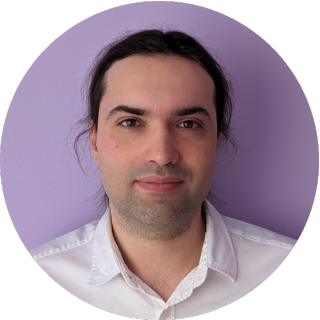

# Dmitry Kutyrev
***Salesforce dev / 1C techlead***

Good day! 👋

My name is Dmitry Kutyrev. I am qualified as a Salesforce developer and as an expert / technical lead in the 1C environment also I have some development experience in Java / Kotlin Android, Java desktop. Participated in more than 10 large successful projects for the implementation of ERP/CRM information systems in various automation schemes and in companies of various profiles, including international ones, 7 years of experience as a technical lead in 1C teams. Worked on different methodologies: Agile, ITIL, waterfall projects. I am currently based in Chisinau, but I am also interested in remote opportunities.

[LinkedIn](https://www.linkedin.com/in/dmitry-kutyrev/) / [GitHub](https://github.com/Kutyrev/) / [SF profile](https://www.salesforce.com/trailblazer/kutyrevdd) / [Google dev profile](https://developers.google.com/profile/u/KutyrevDD) /  proxium ( @ ) gmail.com

Fast links:
1. [Education](#-education)
2. [Certifications & courses](#-certifications--courses)
3. [Languages](#-languages)
4. [Workplaces](#-workplaces--internships)
5. [Projects](#-projects)
    - [Android projects](#android-projects)
    - [Java projects](#java-projects)
    - [DevOps projects](#devops-projects)
    - [1C projects](#1c-projects)
  
## 📋 Education

- Bachelor’s degree in Informatics and Computer Engineering, Siberian State University of Telecommunications and Informatics, 2019
- Specialist’s degree in Marketing, Academy of Economics and Management, 2007

## 📜 Certifications & courses

- Certified ICAgile Professional; 
- ICAgile Team Facilitation;
- ICAgile Product Ownership;
- ITIL 3 Foundation;
- Microsoft Certified Technology Specialist (MCTS). SQL Server® 2008, Implementation and Maintenance;
- MCSA: SQL Server 2012;
- Specialization «Object Oriented Java Programming: Data Structures and Beyond» by UCSD;
- «Management of innovative projects. PMI Methodology and Fundamentals of Project Management Information Systems» by International School of Business;
- Android development program by ELDF.

## 🗿 Languages

Russian (Native) 
English (B1) 
Romanian (A1)

## 🚀 Workplaces & Internships
**Endava** (09/2022 - 12/2022), IT Solutions, Chisinau **Android development intern** 
**RusHydro IT Service** (05/2017 – 08/2022), Inhouse IT Integrator, Moscow **Tech architect, team lead** 
**VDGB** (08/2007 – 04/2017), IT Integrator, Moscow **Senior 1C developer, teamlead**

## 🔨 Projects
### 1C projects
* * *

#### JSC «DRSK» (February 2022 – July 2022). Tech architect, developer. Integration of corporate systems with the unified MDM system.

Integration of two corporate accounting systems with the unified MDM system, including reworking of the process of coordination of master data.

*Stack: 1C 8 framework, REST (Web services, http services), SQL, Postgres, Windows, Cent OS, Redhat*

Responsibilities and achievements: 
- Functional and technical architecture development;
- Coding;
- The process of launching and replicating to new companies.

#### JSC «DGK», JSC «DEK», JSC «DRSK» (January 2021 – June 2022). Tech Architect. Legally significant electronic document management.

Implementation and adaptation of an electronic document management system, including barcoding, approval processes, archive functions, electronic signatures, integration with an accounting system. Based on 1C:Document Management system and a group of external utilities.

*Stack: 1C 8 framework, SQL, Postgres, Windows, Redhat*

Responsibilities and achievements: 
- Technical architecture development;
- Development of performance tests;
- Barcoding subsystem development;
- Development of export to a unified electronic format.

#### JSC «DGK», JSC «DEK», JSC «RAO ESV», Rushydro IT Service (November 2020 – August 2022). Tech architect, developer. Integration of corporate systems with the unified treasury system.

Integration of two corporate accounting systems with the unified treasury system, including reworking of payment processing processes.

*Stack: 1C 8 framework, REST (Web services, http services), SQL, Postgres, Windows, Cent OS, Redhat*

Responsibilities and achievements: 
- Functional and technical architecture development;
- Coding;
- The process of launching and replicating to new companies.

#### JSC «DRSK», JSC «UESK» (December 2019 – November 2020). Tech architect, Replication and adaptation of a corporate unified accounting system for new subsidiaries.

Replication and adaptation of a corporate unified accounting system to the specifics of accounting in companies, including: accounting, budgeting, payment planning, integration with the payroll system, manufacturing.

*Stack: 1C 8 framework, Distributed database, MS SQL*

Responsibilities and achievements: 
- Сode acceptance and refactoring;
- Approval of technical architecture and documentation;
- Control of the work of contractors.

#### RusHydro OCO (November 2019 – February 2020). Tech architect, Implementation and adaptation of the accounting system for service companies of the RusHydro group.

Adaptation of standard solutions for service companies of the RusHydro group, including: accounting, budgeting, payment planning, integration with the payroll system, personnel accounting, payroll preparation.

*Stack: 1C 8 framework, MS SQL, Postgres, Windows, Cent OS*

Responsibilities and achievements: 
- Development of project coding standards;
- Development of technical architecture; 
- Сode acceptance and refactoring;
- Approval of documentation;
- Control of the work of contractors.

#### 10 companies of RusHydro group (January 2018 – November 2018). Tech architect, Upgrade of a corporate distributed system to a new technological platform.

*Stack: 1C 8 framework, Distributed database, MS SQL, Postgres*

Responsibilities and achievements: 
- Architecture verification;
- Work with subcontractors and dev team;
- Results approval;
- Quick bufixes.

Upgrade of a corporate distributed system to a new technological platform including: load tests, performance tests, stability tests, code verification. Migration from 1C 8.2 to 1C 8.3 and from SQL 2008 to SQL 2014. 

#### GU JKH (October 2015 – January 2016). Team lead, Chef developer. ERP system in a housing and communal services company with a national presence.

Performance optimization of the code for non-standard functionality of the ERP system, which made it possible to double the number of simultaneously working users.

*Stack: 1C 8 framework, MS SQL*

Responsibilities and achievements: 
- Operational management of project development team;
- Refactoring of existing code;
- Task evaluation;
- Development of varying degrees of complexity;
- Optimization of performance and scalability;
- Performance testing.

#### Voen telecom (June 2015 – September 2015). Chief developer. Adaptation of the information system for tendering.

Adaptation of a standard solution to the needs and standards of the customer.

*Stack: 1C 8 framework, MS SQL*

Responsibilities and achievements: 
- Refactoring of existing code;
- Task evaluation;
- Development of varying degrees of complexity.

#### Slavyanka (October 2010 – July 2015). Team lead, Chief developer. Information system in the field of housing and communal services in a company with a national presence.

Deployment, adaptation, optimization and support of a cascade (3 levels) distributed database with more than 70 branches.

*Stack: 1C 8 framework, Distributed database, MS SQL*

Responsibilities and achievements: 
- Operational management of project development team;
- Refactoring of existing code;
- Task evaluation;
- Development of varying degrees of complexity;
- Optimization of performance and scalability;
- Performance testing;
- Development of data transfer mechanisms.

#### Vedis (June 2010 – September 2010). Developer. Pilot project of a new product "management of production in housing and communal services"

"Pilot" project of a new product "management of production in housing and communal services" in a construction and service company.

*Stack: 1C 8 framework, MS SQL*

Responsibilities and achievements: 
- Developer by block: housing and communal services.

#### NPP «KVANT» (February 2010 – April 2010). Developer. Implementation and adaptation of production information system including: accounting, personnel accounting, payroll preparation.
*Stack: 1C 8 framework, MS SQL*

Responsibilities and achievements: 
- Developer by blocks: accounting, cost calculation.

#### Parmalat tradehouse (October 2008–December 2009). Analyst, Developer. Implementation and adaptation of information systems: accounting, trade, vehicle accounting. Setting up exchanges between them.
*Stack: 1C 8 framework, MS SQL*

Responsibilities and achievements: 
- Analyst by blocks: warehouse accounting, vehicle accounting;
- Developer by blocks: management reporting, materials accounting;
- Also: Setting up data exchange between warehouse and tradehouse.

### Android projects
* * *

#### RusHydro OCO (March 2021–July 2021). Developer. Mobile application for stocktaking.

Development of a mobile application with the ability to scan barcodes on property and transfer this information to a corporate accounting system.

*Stack: Kotlin, Android JetPack, Retrofit, Google Cloud Vision, JUnit*

Responsibilities and achievements: 
- Full implementation from idea to development.

#### Rushydro IT Services (August 2021 – December 2021). Developer. Mobile application integrated with Legally significant electronic document management system.

The functionality of sighting and movement of a document through the processes.

*Stack: Kotlin, Android JetPack, Retrofit, JUnit*

Responsibilities and achievements: 
- Developer.

### Java projects
* * *

#### Rushydro IT Services (in house dev) (July 2018 – October 2018). Developer. Notification system for failures in the operation of accounting systems.

Development of a little monitoring solution. Checks the availability of services (accounting information systems) using: ping check, webservice connect check, COM+ method call check, network catalog exists check. Notifies you of accidents by email.

*Stack: Java 8, Java FX GUI*

Responsibilities and achievements: 
- Full implementation from idea to development.

### DevOps projects
* * *

#### RusHydro IT Services (in house dev) (June 2020 – August 2020). DevOps engineer. Development of continuous integration and delivery pipelines.

Automation of existing processes of continuous delivery, integration, static code tests and visualization of these processes.

*Stack: 1Script, command shell scripts, Jenkins, Vanessa Runner, SonarQube, Allure, MS SQL*

Responsibilities and achievements: 
- Software setup;
- Scripts development.
